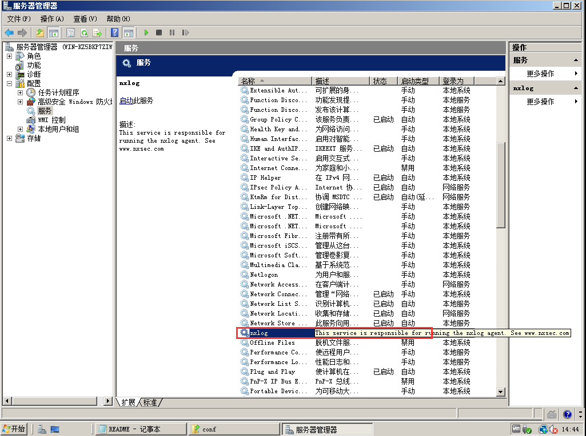

# nxlog

nxlog 是用 C 语言写的一个跨平台日志收集处理软件。其内部支持使用 Perl 正则和语法来进行数据结构化和逻辑判断操作。不过，其最常用的场景。是在 windows 服务器上，作为 logstash 的替代品运行。

nxlog 的 windows 安装文件下载 url 见：
<http://nxlog.org/system/files/products/files/1/nxlog-ce-2.8.1248.msi>

## 配置

Nxlog默认配置文件位置在：`C:\Program Files (x86)\nxlog`。

配置文件中有3个关键设置，分别是：input（日志输入端）、output（日志输出端）、route（绑定某输入到具体某输出）。。

## 例子

假设我们有两台服务器，收集其中的 windows 事务日志：

* logstash服务器ip地址：192.168.1.100
* windows测试服务器ip地址：192.168.1.101

收集流程：

1. nxlog 使用模块 im_file 收集日志文件，开启位置记录功能
2. nxlog 使用模块tcp输出日志
3. logstash 使用input/tcp ，收集日志，输出至es

### Logstash配置文件

```
input {
    tcp {
        port => 514
    }
}
output{
    elasticsearch {
        host => "127.0.0.1"
        port => "9200"
        protocol => "http"
    }
}
```

### Nxlog配置文件

```
<Input testfile>
    Module im_file
    File "C:\\test\\\*.log"
    SavePos TRUE
</Input>

<Output out>
    Module om_tcp
    Host   192.168.1.100
    Port   514
</Output>

<Route 1>
    Path testfile => out
</Route>
```

配置文件修改完毕后，重启服务即可：


